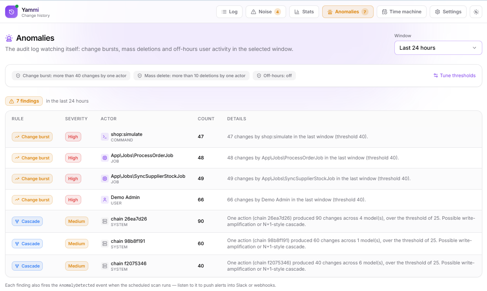

# Yammi Audit Log — Laravel Change History & Audit Trail

[](https://packagist.org/packages/romalytar/yammi-audit-log-laravel)
[](https://packagist.org/packages/romalytar/yammi-audit-log-laravel)
[](https://github.com/RomaLytar/yammi-audit-log/actions/workflows/ci.yml)
[](https://github.com/RomaLytar/yammi-audit-log/actions/workflows/ci.yml)
[](https://github.com/RomaLytar/yammi-audit-log/actions/workflows/ci.yml)
[](https://packagist.org/packages/romalytar/yammi-audit-log-laravel)

**Change history and execution tracing for distributed, queue-heavy Laravel apps: every change recorded with the real actor, origin and correlation behind it.**

## Why this exists

Most Laravel audit tools record *what* changed on a model. Real systems are distributed:

```
HTTP request  →  service  →  queue  →  job  →  model
```

By the time the row is written, the question that matters during an incident is hard to answer: *who actually triggered this change, and through what chain?*

This package records the full execution context of every change, not just the final write.

## The core idea

Captured automatically on every change, with no per-model setup. Each record carries:

- **Actor**: who executed the change (`user`, `job`, `command`, `scheduler`, `system`), resolved by an extensible provider chain. Login-as is handled too: `Jane Doe (impersonated by Support Admin)`.
- **Origin**: who started the chain, serialized into the queue payload so it survives async jobs.
- **Correlation id**: one id across request → service → queue → job → model.

```json
{
    "event": "updated",
    "auditable": "App\\Models\\Order #42",
    "actor":  {"type": "job",  "label": "App\\Jobs\\ChargeOrder"},
    "origin": {"type": "user", "label": "John Doe"},
    "correlation_id": "550e8400-e29b-41d4-a716-446655440000",
    "changes": {"status": {"old": "pending", "new": "paid"}}
}
```

A user clicked "pay", a queued job made the write, and the log kept both. Each record also stores a field-level before/after diff, with secrets (`password`, `token`, `api_key`, …, including nested JSON) redacted before they reach the database.


## Quickstart

```bash
composer require romalytar/yammi-audit-log-laravel
php artisan migrate
php artisan audit-log:ui enable          # optional dashboard at /audit-log
```

```php
User::first()->update(['name' => 'Test']);
```

Open `/audit-log`. The change is already there, with its actor, origin and correlation id filled in. No setup is required for basic model auditing (the optional traits below are only for special cases). Defaults are safe out of the box (UI off until you enable it, 180-day retention, secrets redacted).

## How it works

The mechanism behind the three fields above:

1. One global listener catches Eloquent's `created` / `updated` / `deleted` / `restored` events, nothing to register per model.
2. A small pipeline builds the diff, redacts secrets, resolves actor + origin + correlation, and snapshots foreign-key labels.
3. It writes one row into the `audit_log` table.

Optionally, defer that write to the queue (`AUDIT_LOG_WRITE_ASYNC=true`) or move the table to a dedicated connection.


## Requirements and what it installs

- PHP `^8.1`, Laravel `^9.0 || ^10 || ^11 || ^12 || ^13`, any database Laravel supports.
- Capture is built on Eloquent model events. Changes made by `Query Builder ->update()` or raw SQL are not seen automatically; record those explicitly with `AuditLog::record()`.
- Migrations create four auto-loaded tables: `audit_log` (the records), `audit_log_settings` (the settings UI), and `audit_log_digests` + `audit_log_chain_state` (used only when integrity is enabled). They can live on a dedicated connection.
- Every record carries an `event_version` (the record-schema version), stamped on write and included in the JSON API and SIEM payloads, so consumers can rely on the layout and branch on it if the schema ever changes.
- A queue is needed only if you opt into async writes or SIEM streaming; the default write path is synchronous.

## Performance

A log package lives on your hot path, so the cost is kept deliberate and predictable:

- One insert for the record, plus a single batched insert for its changed-field index, on the write path.
- Capture services are resolved once per request, not per event.
- No extra queries during capture, with two opt-in exceptions: foreign-key label lookups for columns you map, and one chain-head select when integrity is on.
- Field-level searches (`field('status')`) seek an indexed changed-keys table instead of scanning the JSON of every row, so they stay fast on large tables.
- Async mode moves the insert itself off the request.
- The write is fail-open: a failed audit insert is logged and does not block the host operation.
- Reads are bounded: one-year ranges, 10k-row exports, chunked retention.

The Statistics page turns that into a picture: growth and projected size, the heaviest correlation cascades, and the most-changed models and fields.


## Platform features (optional)

Independent capabilities built on the core, each off or zero-cost until you use it.

### Capture policy and sampling

The default is safe: capture everything. When you need to govern a model's volume, declare a policy in one place — ignore noisy fields, capture only under a condition, or sample a fraction of high-churn models.

```php
AuditLog::policy(Order::class)
    ->ignore(['updated_at'])                            // drop noisy fields
    ->when(fn ($order) => $order->tenant_id === 'acme') // capture conditionally
    ->sample(0.1);                                      // keep ~10% of the changes
```

Sampling is decided per correlation, not per row, so the full history of one record within a unit of work is kept or dropped together — never left with holes.

### Time machine

Reconstruct the exact state a record had at any past moment, folded from its diffs. Read-only: it shows real history, it never rewrites anything.

```php
AuditLog::stateAt(Order::class, 42, '2026-03-03');
```


### Tamper evidence

Hash-chain every record (SHA-256) and verify, after the fact, that nothing was edited or removed.

```bash
# AUDIT_LOG_INTEGRITY=true
php artisan audit-log:verify
```

### Anomaly detection and alerts

The log watches itself, on demand or on a cron, and findings go to Slack, a signed webhook or mail. Built-in rules:

- **Change burst**: one actor making more than N changes in the window.
- **Mass delete**: one actor deleting more than N records.
- **Off-hours**: user activity inside a configured hour range.
- **Cascade weight**: one correlation (a single request → job → job chain) that produced an unusually large number of changes across many models. Because the audit log already knows the full execution chain, this surfaces likely write-amplification or N+1-style cascades as a side-effect signal, no profiler required.

You can also add your own rules as code (see the Enterprise section), and tune every threshold from the Settings UI.



### GDPR and compliance

Subject access reports in one command, retention on by default, archive-before-delete to any disk, recursive secret redaction.

```bash
php artisan audit-log:subject-report "App\Models\User" 5 --format=html
```

### Facades and JSON API

The dashboard is optional, everything it shows is also available as plain DTOs through one facade (and an opt-in JSON API):

```php
AuditLog::for(Order::class, 42);          // timeline of one record
AuditLog::chain($correlationId);          // the full cascade
AuditLog::changes(['event' => 'updated', 'actor_type' => 'job']);
AuditLog::record(...);                    // manual write for mass updates / raw SQL

// Or the same query as a fluent builder (sugar over changes(), same results):
AuditLog::query()->field('status')->from('pending')->to('paid')->actorType('job')->get();
```

The full surface (`stateAt`, `noise`, `stats`, `recordView`, `subjectReport`, `anomalies`, …) and the JSON API endpoints are listed in the in-app docs at `/audit-log/settings/docs`.

## Enterprise (optional subsystems)

Independent subsystems, each collapsed below. Open what you need.

<details>
<summary><b>Stream to your SIEM (Splunk / Datadog / Elastic / HTTP)</b></summary>

Ship every recorded change to your SIEM, off the request path, queued and fail-soft, so a slow or dead sink does not touch the host write:

```php
// config/audit-log.php → 'stream'
'enabled'  => true,
'driver'   => 'splunk',                                   // splunk | datadog | elastic | http
'endpoint' => 'https://splunk.example:8088/services/collector/event',
'token'    => env('AUDIT_LOG_STREAM_TOKEN'),
'source'   => 'orders-api',
```

The normalized event is built once and wrapped in each platform's envelope. Delivery is a queued job with one retry on 5xx.

</details>

<details>
<summary><b>Multi-tenancy</b></summary>

Implement one contract and point the config at it:

```php
final class CurrentTenantResolver implements \Yammi\AuditLog\Application\Contract\Resolver\TenantResolver
{
    public function resolve(): ?string
    {
        return tenant()?->id;
    }
}

// config/audit-log.php
'tenancy' => ['resolver' => CurrentTenantResolver::class],
```

Records are stamped with the tenant at capture time (it survives the queue), every read is tenant-scoped automatically, and retention, archive and integrity verification run across all tenants. Returning `null` means single-tenant: nothing changes.

</details>

<details>
<summary><b>Access logging (who *viewed* a record)</b></summary>

Under HIPAA/GDPR, *who looked at this PII* matters as much as who changed it. Opt in per model with the `LogsAccess` trait, or record from anywhere:

```php
use Yammi\AuditLog\Concerns\LogsAccess;

class Patient extends Model { use LogsAccess; }

$patient->recordAccess();                      // event: accessed, attributed to the viewer
AuditLog::recordAccess(Patient::class, $id);   // or without the trait
```

Reads are high-volume, keep `retention_days` tight when you enable this.

</details>

<details>
<summary><b>Pivot auditing (attach / detach / sync)</b></summary>

Eloquent fires no model events for pivot writes, so a plain `$user->roles()->sync([...])` leaves no trace. Add the `AuditsPivots` trait and use the audited wrappers, which record the before/after set through the full pipeline:

```php
use Yammi\AuditLog\Concerns\AuditsPivots;

$user->auditAttach('roles', $roleId);   // event: attached
$user->auditDetach('roles', [$a, $b]);  // event: detached
$user->auditSync('roles', [$a, $c]);    // event: synced
```

</details>

<details>
<summary><b>Anomaly rules as code</b></summary>

For domain-specific detection, write a rule class, version it in git, unit-test it in isolation, and it runs alongside the built-ins over the same window:

```php
use Yammi\AuditLog\Application\Contract\AnomalyRule;
use Yammi\AuditLog\Application\DTO\Anomaly\AnomalyData;
use Yammi\AuditLog\Application\DTO\Anomaly\AnomalyWindow;
use Yammi\AuditLog\Application\DTO\Audit\TimelineEntryData;

final class PriceDropRule implements AnomalyRule
{
    public function key(): string { return 'price_drop'; }

    /** @param list<TimelineEntryData> $entries @return list<AnomalyData> */
    public function evaluate(array $entries, AnomalyWindow $window): array
    {
        // inspect $entries, return AnomalyData findings with your own severity
    }
}

// config/audit-log.php → 'anomalies' => ['rules' => [PriceDropRule::class]]
```

Rules receive the window's changes as plain DTOs, no database, no framework. A throwing rule is isolated and does not break the scan.

</details>

<details>
<summary><b>Signed integrity digests (detect whole-segment deletion)</b></summary>

The hash chain catches edits to stored rows. A signed digest goes further, it attests the chain head, record count and time span at a moment, signed with your asymmetric key, so deleting whole segments (or the entire table) is detectable, and an archived digest verifies independently of the database.

```bash
php artisan audit-log:digest    # record a signed snapshot
php artisan audit-log:verify    # checks the chain AND the latest signed digest
```

</details>

<details>
<summary><b>More: change reason, value transitions, per-subject feed</b></summary>

```php
// Stamp every change inside a unit of work with a reason (covered by the integrity chain):
AuditLog::withReason('ticket #4521', fn () => $order->update(['status' => 'refunded']));

// "Who moved an order to cancelled?" is one filter, not a scan:
AuditLog::changes(['field' => 'status', 'value_from' => 'pending', 'value_to' => 'cancelled']);

// Hand a user a signed, read-only "Account activity" page, scoped to one subject, no login:
$url = AuditLog::activityUrl($user, $user->id, minutes: 30);
```

The dashboard also carries a record view, noise diagnostics (double writes flagged), statistics with a 30-day heatmap, and a settings UI to tune the package without a redeploy.

</details>

## Security

The defaults aim to be safe; you stay in control of the trade-offs.

- **Secret redaction** runs before the diff is stored, so configured secret keys are kept out of the database (`[redacted]`). You define the key patterns.
- **Fail-open by design.** The write path aims not to block your application: if the audit insert fails, the error is logged and the business operation continues. If you need the opposite guarantee (no record, no write), wrap both in your own transaction.
- **UI off by default**, behind configurable middleware (`web`, `auth`), an optional Gate and a rate limit. The dashboard serves its own assets, so it makes no external CDN request and needs no CSP exceptions.
- **API can be configured to fail closed.** The read-only JSON API will not register without an auth guard in its middleware; the dashboard's destructive actions (database transfer, the write playground) can be put behind host-defined Gates.
- **Signed outbound webhooks** (HMAC-SHA256) let receivers verify an alert is genuine.
- **Input is validated and bounded**: filters constrained, LIKE patterns escaped, route params typed, CSV export escapes formula characters.
- **Retention on by default**, audit data is PII.

## How it compares

Existing Laravel audit packages, [spatie/laravel-activitylog](https://github.com/spatie/laravel-activitylog) and [owen-it/laravel-auditing](https://github.com/owen-it/laravel-auditing) among them, focus on model changes and user activity. This one focuses on queue-heavy, distributed apps that need execution traceability: cross-layer attribution (request → job → job), an origin that survives async, correlation tracing, and tamper-evident history for incident investigation, in one self-contained package. If your current setup covers your needs, keep it.

## Non-goals — what this package will not do

These are deliberate, permanent boundaries. Each of them would force the audit log to become a *source of truth* or a *real-time system*, and that breaks the invariant that makes it safe to install: capture is fail-closed, off your write path, additive, and never changes your data.

- **No event sourcing or state replay.** The Time machine reconstructs past state read-only, for forensics. It never becomes the system of record you rebuild your application from.
- **No backpressure engine or priority queues.** Sampling governs volume; broker-grade load shaping is Kafka/SaaS territory, not a package's job.
- **No search engine inside the package.** Search goes outward to your SIEM/Elastic (streaming is built in) and inward through the indexed changed-keys table — not a bundled Meilisearch or Elastic adapter.
- **No distributed observability platform.** Metrics, traces and dashboards at that scale belong to Datadog / Splunk / Pulse. Our moat is application-level provenance, not competing with them.
- **No query profiler or distributed tracing.** We surface write-side cascades from data we already capture; read-path query profiling is Telescope / Pulse territory.

## Configuration

```php
// config/audit-log.php (publish with vendor:publish --tag=audit-log-config)
return [
    'enabled'   => env('AUDIT_LOG_ENABLED', true),
    'capture'   => ['mode' => env('AUDIT_LOG_CAPTURE_MODE', 'all')], // all | opt_in
    'retention' => ['days' => env('AUDIT_LOG_RETENTION_DAYS', 180)],
    'write'     => ['async' => env('AUDIT_LOG_WRITE_ASYNC', false)],
    'integrity' => ['enabled' => env('AUDIT_LOG_INTEGRITY', false)],
    'ui'        => ['enabled' => env('AUDIT_LOG_UI_ENABLED', false), 'middleware' => ['web', 'auth']],
    'database'  => ['connection' => env('AUDIT_LOG_DB_CONNECTION')], // optional dedicated connection
];
```

Operational settings (retention, redaction, alert channels, anomaly thresholds, …) can also be edited from the Settings UI without a redeploy. Resolution order: **DB row → config value → package default**. Bootstrap-critical values and secrets stay in `config`/`.env`.

## License

MIT
