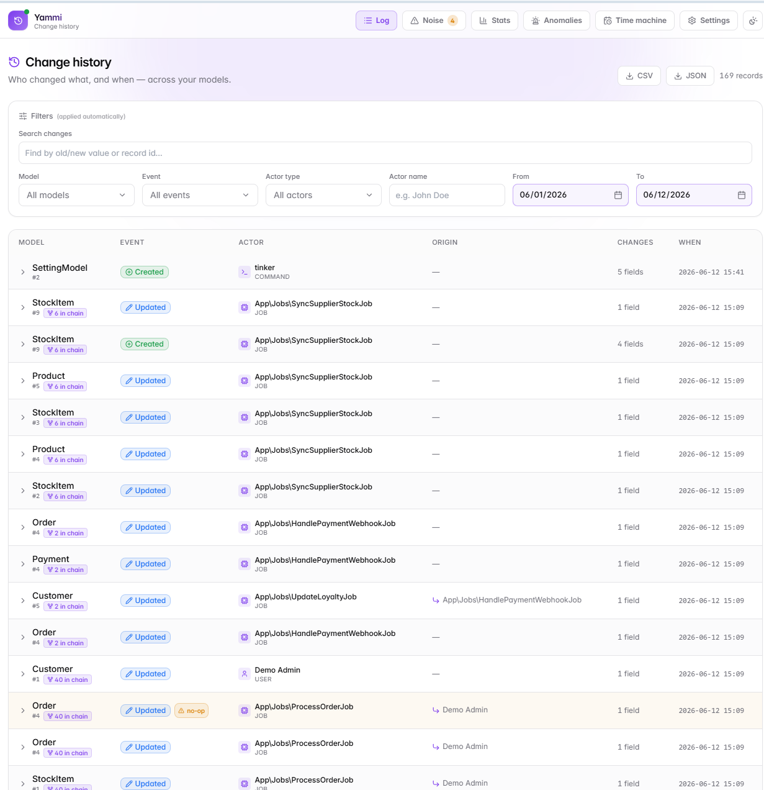
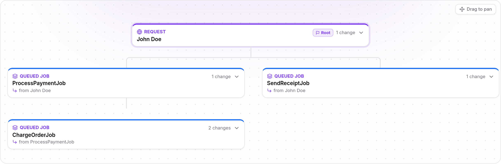
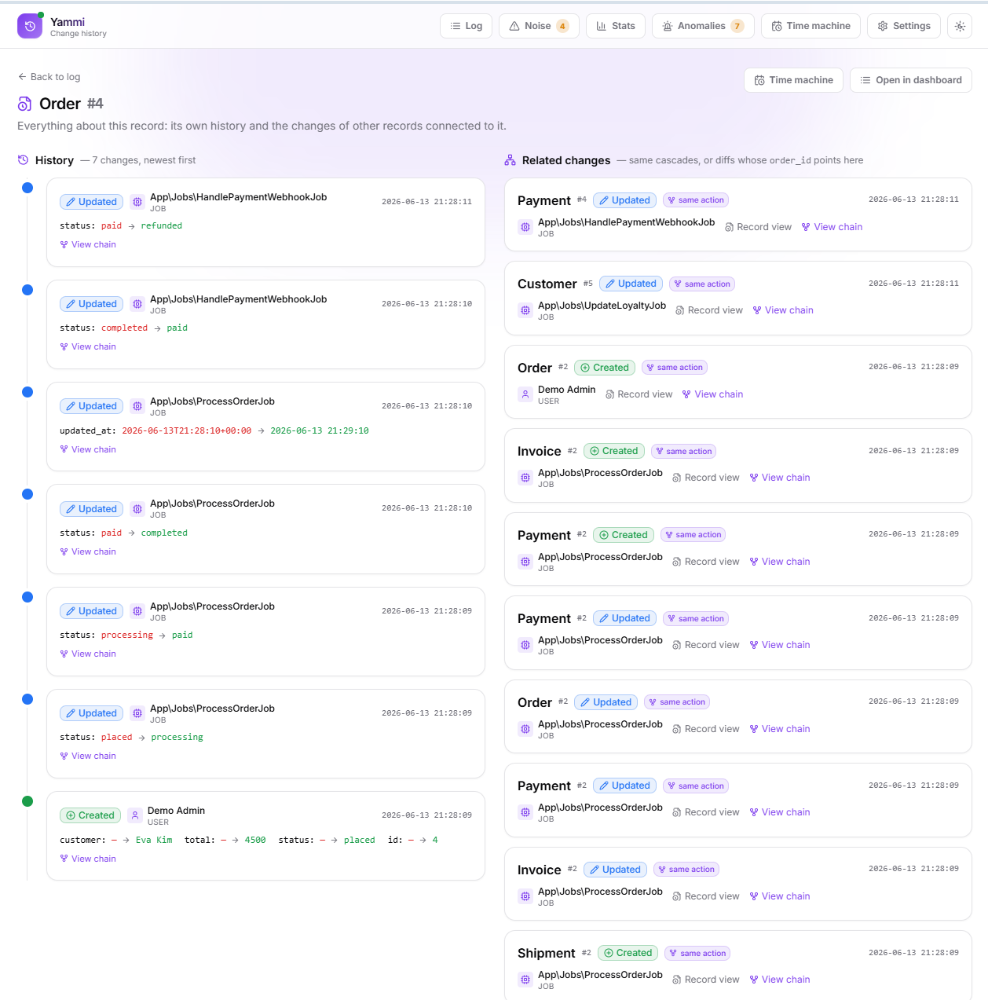
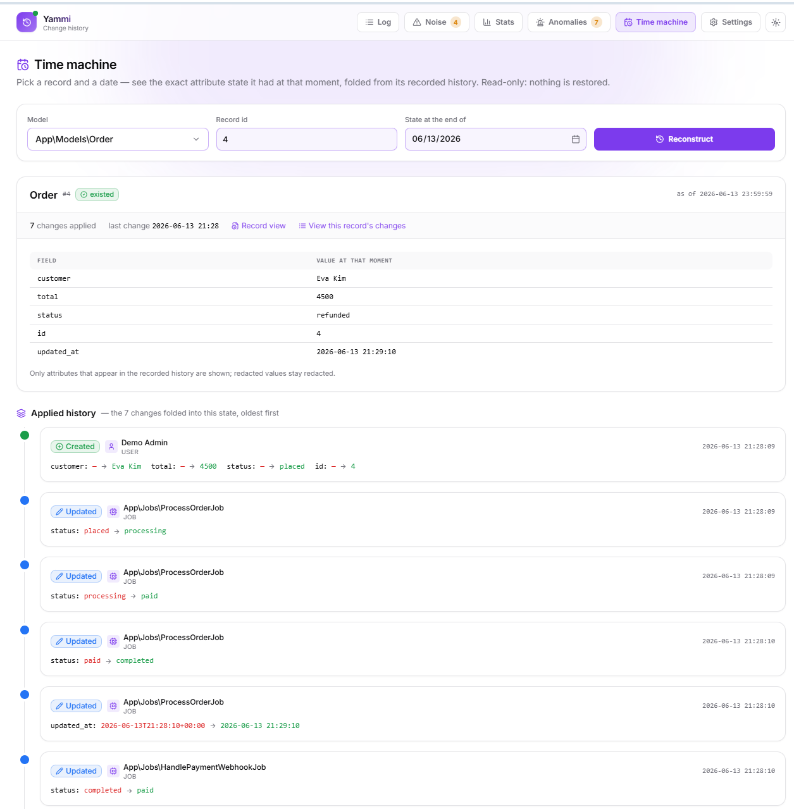
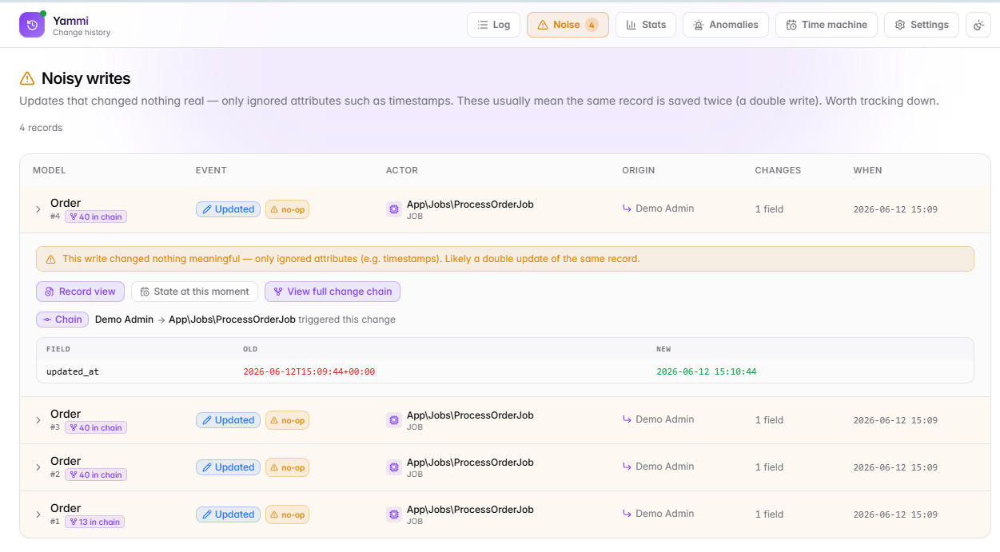
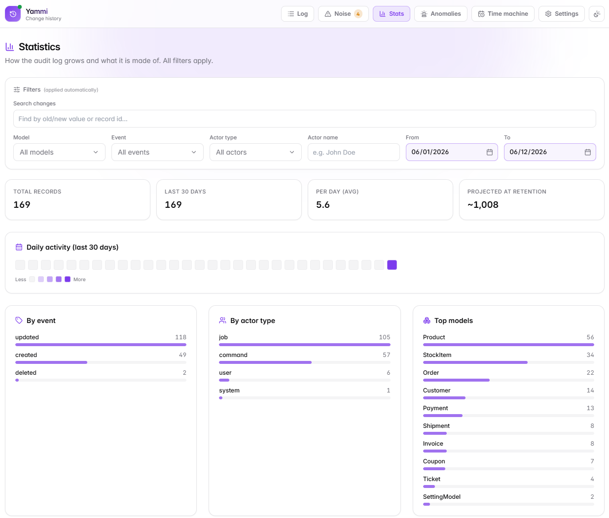
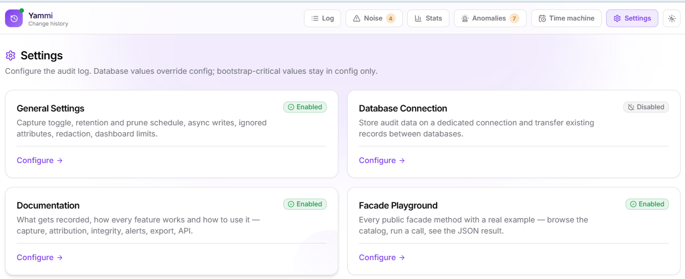

# Yammi Audit Log — Laravel Change History & Audit Trail

[](https://packagist.org/packages/romalytar/yammi-audit-log-laravel)
[](https://packagist.org/packages/romalytar/yammi-audit-log-laravel)
[](https://github.com/RomaLytar/yammi-audit-Log/actions/workflows/ci.yml)
[](https://github.com/RomaLytar/yammi-audit-Log/actions/workflows/ci.yml)
[](https://github.com/RomaLytar/yammi-audit-Log/actions/workflows/ci.yml)
[](https://packagist.org/packages/romalytar/yammi-audit-log-laravel)

**The audit log that answers not only *what* changed, but *who* really changed it, and why.** Every Eloquent create/update/delete/restore is recorded with a real actor (user, queued job, Artisan command, scheduler), the person who *started* the cascade, field-level diffs with secret redaction, and a correlation id that ties a whole request → job → job chain together. The only Laravel audit log with **verifiable history integrity**: hash-chain every record and prove nobody edited the past.

Zero per-model setup. Install, migrate, done, the dashboard is optional and off by default.



## Install

```bash
composer require romalytar/yammi-audit-log-laravel
php artisan migrate

# optional, only if you want the bundled admin dashboard at /audit-log:
php artisan audit-log:ui enable
```

That's it, changes are being recorded. **No publishing needed:** the package config and migrations are auto-discovered and loaded automatically; defaults are safe (UI off, 180-day retention, secrets redacted). Run `vendor:publish` only when you want to customize the config or the views, see [Publishing assets](#publishing-assets).

## Requirements

- PHP `^8.1`
- Laravel `^9.0 || ^10.0 || ^11.0 || ^12.0 || ^13.0`
- Any database supported by Laravel

## Features

- [Actor attribution & change chains](#actor-attribution--change-chains), the moat: who did it, even through the queue
- [Record view](#record-view), one page per record: history + everything connected to it
- [Time machine](#time-machine), the exact state a record had at any past moment
- [Noise diagnostics](#noise-diagnostics), double writes flagged, not hidden
- [Statistics](#statistics), volume, breakdowns, 30-day activity heatmap
- [Anomaly detection](#anomaly-detection), change bursts, mass deletions, off-hours activity
- [Alerts: Slack, webhook, mail](#alerts-slack-webhook-mail), hear about sensitive changes instantly
- [GDPR & compliance](#gdpr--compliance), subject access reports, retention, archive, redaction
- [Tamper evidence](#tamper-evidence), hash-chained history, `audit-log:verify`
- [Multi-tenancy](#multi-tenancy), tenant isolation out of the box
- [Embed it your way](#embed-it-your-way), facades for everything, JSON API, playground
- [Settings UI](#settings-ui), tune the package without a redeploy

---

## Actor attribution & change chains

Most audit packages collapse a status flip by a queued job, a command or the scheduler into an anonymous `null`. Here attribution is first-class:

- **Actor types:** `user`, `job`, `command`, `scheduler`, `system`, resolved by a chain of providers you can extend.
- **Origin survives the queue.** A job dispatched by a user keeps that user attached, serialized into the queue payload, proven by tests against a real database queue worker.
- **Correlation per unit of work.** Every change made by one request, command or job cascade shares one id; the trace page draws the cascade as a ladder, indented by job nesting depth. Coming from a record? The entry you came from is highlighted and scrolled into view.
- **Impersonation-proof.** When an admin works as another user (login-as), the label names both: `Jane Doe (impersonated by Support Admin)`. Works with lab404/laravel-impersonate out of the box; session keys are configurable.



---

## Record view

One page per record: its full history on the left, every *connected* change on the right, records changed by the **same action** (correlation chains) and diffs of other models whose `<model>_id` **points at this record**. Honest data only: no guessed relationships.

```php
$view = AuditLog::recordView(Order::class, 42);
```



---

## Time machine

Pick a record and a date, see the exact attribute state it had at that moment, folded from its recorded diffs, with the applied history underneath. Strictly read-only: this package shows real history, it never restores or rewrites anything.

```php
$state = AuditLog::stateAt(Order::class, 42, '2026-03-03');

if ($state->existed) {
    echo $state->attributes['status'];
}
```



---

## Noise diagnostics

An update that changed nothing real, only ignored attributes such as timestamps, is recorded and flagged as a no-op. These usually mean the same record is saved twice. The Noise page lists them and the nav badge counts them, so double writes are easy to hunt down instead of silently inflating your log.



---

## Statistics

Volume cards (total, last 30 days, per-day average, projection at your retention), breakdowns by event / actor type / model, and a GitLab-style 30-day activity heatmap. Every dashboard filter applies.



---

## Anomaly detection

The audit log watches itself. Three rules, all tunable from Settings:

| Rule | What fires it |
|---|---|
| Change burst | One actor made more than N changes inside the window |
| Mass delete | One actor deleted more than N records inside the window |
| Off-hours | User activity inside a configured hour range (e.g. `0,5`) |

Run on demand from the **Anomalies** page (1 hour – 30 days window), from the console (`audit-log:detect-anomalies`), or on a cron. Every finding fires the `AnomalyDetected` event and goes to the alert channels below.

---

## Alerts: Slack, webhook, mail

Declare rules, model, optionally attributes and events, and a matching change fires everywhere at once:

- **Slack** incoming webhook: Block Kit message with the diff summary and a deep link to the filtered feed.
- **Generic JSON webhook** for incident routers and automation hubs, signed with HMAC-SHA256 (`X-Audit-Log-Signature`) so receivers can verify authenticity. One retry on 5xx.
- **Mail** to configured recipients.
- `SensitiveChangeRecorded` event for anything custom.

```php
// config/audit-log.php
'alerts' => [
    'rules' => [
        ['model' => App\Models\User::class, 'attributes' => ['role'], 'events' => ['updated']],
    ],
    'mail_to' => ['security@your.app'],
    'slack_webhook_url' => env('AUDIT_LOG_SLACK_WEBHOOK'),
    'webhook' => ['url' => env('AUDIT_LOG_WEBHOOK_URL'), 'secret' => env('AUDIT_LOG_WEBHOOK_SECRET')],
],
```

Every channel is fail-soft: a dead webhook never breaks the write path it piggybacks on.

---

## GDPR & compliance

- **Subject access reports** (GDPR Art. 15) in one command, every change made *to* the record plus every change made *by* it:

  ```bash
  php artisan audit-log:subject-report "App\Models\User" 5 --format=html
  ```

- **Retention** on by default (180 days, clamped 7–9999) with a scheduled prune, audit data is PII.
- **Archive before delete:** `audit-log:archive --then-prune` writes expiring records as NDJSON to any filesystem disk (S3 included).
- **Recursive secret redaction** before anything touches the database: `password`, `token`, `api_key`, …, including inside nested JSON values. Configurable patterns and placeholder.
- **Export** of any filtered view as CSV/JSON, capped by rows and a one-year range, with CSV-injection protection.

---

## Tamper evidence

Turn on `AUDIT_LOG_INTEGRITY=true` and every record is hash-chained (SHA-256) to the previous one inside a locked transaction, concurrent writers cannot fork the chain.

```bash
php artisan audit-log:verify
# Integrity OK: 169 hashed record(s) verified.
```

If someone edits or deletes a row in the table, `verify` names the first broken record. Pruning stores a chain anchor so verification stays strict even after retention deletes old rows. No other Laravel audit package can prove its history was not edited.

---

## Multi-tenancy

Running a SaaS? Implement one tiny contract and point the config at it:

```php
final class CurrentTenantResolver implements \Yammi\AuditLog\Application\Contract\TenantResolver
{
    public function resolve(): ?string
    {
        return tenant()?->id;
    }
}

// config/audit-log.php
'tenancy' => ['resolver' => CurrentTenantResolver::class],
```

Every new record is stamped with the tenant **at capture time** (it survives the queue), and every read, dashboard, facades, JSON API, exports, is scoped to the current tenant automatically. Retention, archive and integrity verification always run across all tenants. Returning `null` means single-tenant: nothing changes.

---

## Embed it your way

The dashboard is optional. Everything it shows is available as plain DTOs through one facade:

```php
AuditLog::for(Order::class, 42);          // timeline of one record
AuditLog::changes(['event' => 'updated', 'actor_type' => 'job']);
AuditLog::noise();                        // flagged double writes
AuditLog::chain($correlationId);          // the full cascade
AuditLog::stats(['model' => Order::class]);
AuditLog::anomalies(1440);                // the scan as data
AuditLog::recordView(Order::class, 42);   // history + related changes
AuditLog::subjectReport(User::class, 5);  // GDPR report as data
AuditLog::stateAt(Order::class, 42, '2026-03-03');
AuditLog::record(...);                    // manual write for mass updates / raw SQL
```

- **Facade Playground** at `/audit-log/settings/playground`: browse every method, fill the auto-generated form, run it, see the JSON.
- **Opt-in JSON API** (`AUDIT_LOG_API_ENABLED=true`, bring your own auth middleware): `changes`, `noise`, `chain/{uuid}`, `stats`, `timeline`, `state`, `record-view`, `subject-report`, `anomalies`.
- **JobsMonitor bridge:** set `AUDIT_LOG_JOBS_MONITOR_URL` and every job actor links straight to [Yammi Jobs Monitor](https://github.com/RomaLytar/yammi-jobs-monitoring-laravel).

---

## Settings UI

Operational config lives in the database so operators can tune the package without a redeploy: capture toggle, retention and prune schedule, async writes, integrity, ignored attributes, redaction, alert channels, anomaly thresholds, display timezone and more, across 7 groups, with built-in documentation covering every feature.

Resolution order: **DB row → config value → package default**. Bootstrap-critical values (database connection, route path, middleware, gate) and secrets stay in `config`/`.env` on purpose.



---

## Choosing what gets audited

```php
// Everything is captured by default. Narrow it per model:
class Document extends Model
{
    public array $auditExclude = ['internal_notes'];   // never stored
    // or the inverse:
    public array $auditInclude = ['status', 'price'];  // only these
}

// Or flip to opt-in mode: only models implementing the marker are recorded.
// AUDIT_LOG_CAPTURE_MODE=opt_in
class Order extends Model implements \Yammi\AuditLog\Contracts\ShouldAudit {}
```

### Honest limitations

Eloquent events never fire for mass `Query Builder ->update()`, raw SQL or pivot `sync()`, no event-based audit package sees those. Record them explicitly through the same pipeline (redaction, attribution, correlation included):

```php
Order::where('status', 'pending')->update(['status' => 'cancelled']);

AuditLog::record(Order::class, $order->id, 'updated',
    before: ['status' => 'pending'],
    after:  ['status' => 'cancelled'],
);
```

---

## How it compares

| | spatie/laravel-activitylog | owen-it/laravel-auditing | Yammi Audit Log |
|---|---|---|---|
| Per-model include/exclude | yes | yes | yes, without traits |
| Request metadata (ip/url/agent) | — | yes | yes, opt-in, real HTTP only |
| Multi-level actor (user/job/command/scheduler) | — | — | yes |
| Origin through a real queue | — | — | yes |
| Correlation traces across models | batch uuid | — | yes, with a trace UI |
| Time machine (state at any date) | — | partial | yes |
| Tamper-evident hash chain + verify | — | — | yes |
| GDPR subject report in one command | — | — | yes |
| Impersonation-aware attribution | — | — | yes |
| Anomaly detection + Slack/webhook alerts | — | — | yes |
| Native multi-tenancy | — | — | yes |
| Dashboard, stats, settings UI, playground | — | third-party | yes, optional |

If you come from spatie: everything you are used to is here, plus a real actor instead of a `causer` and traces instead of batches. If you come from owen-it: your request metadata and queued writes are here, plus the dashboard, retention, integrity and alerts you had to build yourself.

---

## Configuration

```php
// config/audit-log.php (publish with vendor:publish --tag=audit-log-config)
return [
    'enabled' => env('AUDIT_LOG_ENABLED', true),

    'capture' => [
        'mode' => env('AUDIT_LOG_CAPTURE_MODE', 'all'),   // all | opt_in
        'ignore_attributes' => ['created_at', 'updated_at'],
        'request_context' => env('AUDIT_LOG_REQUEST_CONTEXT', false),
    ],

    'redaction' => [
        'keys' => ['password', 'token', 'secret', 'api_key', /* … */],
        'placeholder' => '[redacted]',
    ],

    'retention' => ['days' => env('AUDIT_LOG_RETENTION_DAYS', 180)],

    'write' => ['async' => env('AUDIT_LOG_WRITE_ASYNC', false)],

    'integrity' => ['enabled' => env('AUDIT_LOG_INTEGRITY', false)],

    'ui' => [
        'enabled' => env('AUDIT_LOG_UI_ENABLED', false),
        'path' => 'audit-log',
        'middleware' => ['web', 'auth'],
        'gate' => env('AUDIT_LOG_UI_GATE'),
    ],

    'database' => [
        // Optional dedicated connection + audit-log:transfer-data command.
        'connection' => env('AUDIT_LOG_DB_CONNECTION'),
    ],
];
```

### Publishing assets

```bash
php artisan vendor:publish --tag=audit-log-config
php artisan vendor:publish --tag=audit-log-views
php artisan vendor:publish --tag=audit-log-migrations
```

---

## Security

- **Secrets never reach the database.** Recursive redaction runs before the diff is stored; changed secret values are still audited, as `[redacted]`.
- **Fail-closed write path.** If the audit insert fails, the error goes to your log and your request continues untouched.
- **UI off by default**, behind configurable middleware (`web`, `auth`), an optional Gate and a rate limit.
- **Read-only JSON API**, off by default, with host-chosen auth; the one write method (`record()`) is deliberately PHP-only.
- **Signed outbound webhooks** (HMAC-SHA256) so receivers can verify alerts are genuine.
- **Strict input parsing** everywhere: filters validated and bounded (max one-year range), LIKE patterns escaped, route params constrained, CSV export neutralises formula injection.
- **Retention is on by default**, audit data is PII.

---

## License

MIT
